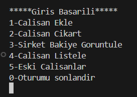
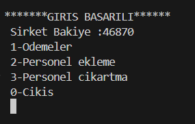
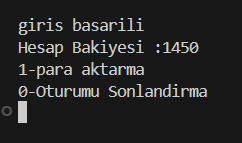

# Şirket Muhasebe ve Personel Yönetim Sistemi

Bu proje, **C dili öğrenme sürecimde geliştirdiğim ilk console uygulamasıdır.**  
tamamen **dosya tabanlı (File I/O)** yapı ile:

- Şirket çalışan yönetimi
- Maaş / ikramiye / yardım ödemeleri
- Personel bakiye takibi
- Banka hesapları

gibi işlemler yapılabilir.

Amaç, temel dosya işlemleri, kontrol akışı, fonksiyon yapısı ve kullanıcı senaryolarını gerçek bir sistem akışına simüle etmektir.

## Arayüz Ekran Görüntüleri

| Admin Paneli | Muhasebe Paneli | Personel Paneli |
|---|---|---|
|  |  |  |


## Rol Yapısı ve Yetkiler

| Rol | Açıklama | Yetkiler |
|---|---|---|
| **Admin (Yönetici)** | Sistemin en yetkili kullanıcısıdır | Tüm personeli yönetme, şirket kasasına erişim , kasaya para girişi, para aktarma |
| **Muhasebe Çalışanı** | Ödeme işlemlerini ve alt personeli yönetir | Personel ekleme / çıkarma, Maaş/Yardım/ikramiye Ödemeleri, kasa görüntüleme |
| **Personel** | Sistemin normal çalışan kullanıcısı | Hesap bakiyesini görüntüler, banka hesabına para aktarabilir |


## 🔵 Veri Dosyaları

Sistem tüm verileri `.txt` dosyalarında saklar.  
Her satır bir kaydı temsil eder.

| Dosya | Veri Formatı | Örnek | Açıklama |
|---|---|---|---|
| `administrator.txt` | `adminNo şifre` | `1111 9999` | Sisteme giriş yapabilen yönetici |
| `kullanici.txt` | `no şifre ad` | `1169 8520 Berna` | Muhasebe çalışanları |
| `personel.txt` | `no şifre ad` | `1111 1234 Fulya` | Personeller |
| `istenCikarilanlar.txt` | `no şifre ad` | `1133 7120 Cenk` | İşten çıkarılmış personel arşivi |
| `bakiyesi.txt` | `no bakiye` | `1111 5000` | Personel hesap bakiyeleri |
| `sirketBakiye.txt` | `bakiye` | `150000` | Şirket toplam bakiyesi |
| `bankaHesabi.txt` | `hesapNo bakiye` | `78945 25700` | Banka hesap bakiyeleri | 


## 🔵 Çalıştırma

### Derleme (Windows - MinGW)
```bash
gcc main.c -o main
```
### Çalıştırma:
```bash
./main
```
📝 Not
Bu proje; temel C programlama, dosya yönetimi ve console tabanlı menü tasarımlarını öğrenme amacıyla geliştirilmiştir.
